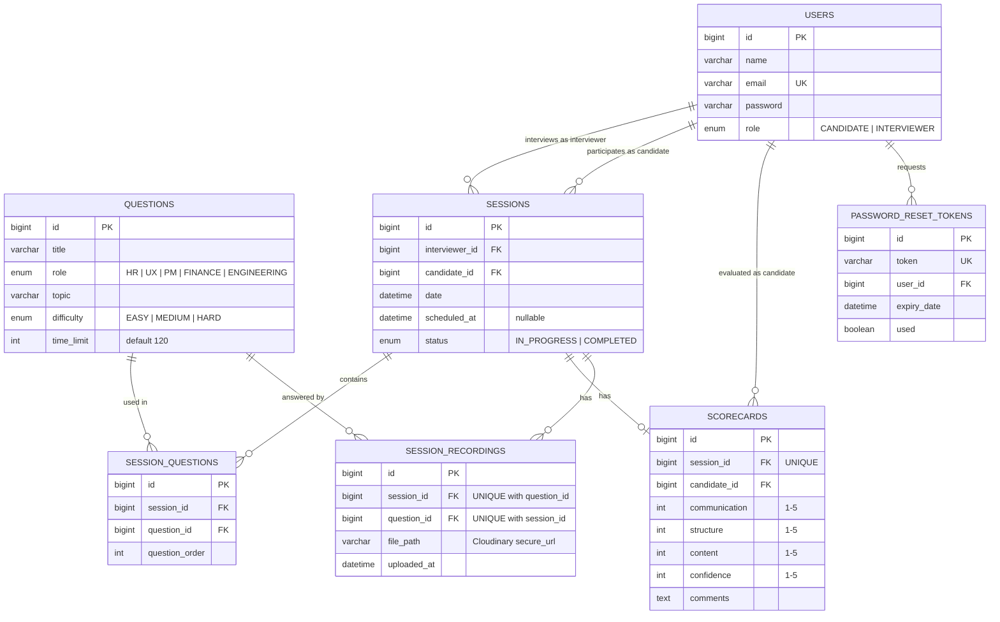

# ER Diagram — TalentEval

## Entity Relationship Diagram

## Relationships Summary

| Relationship | Type | Description |
|---|---|---|
| User → Session (as interviewer) | One-to-Many | An interviewer can conduct many sessions |
| User → Session (as candidate) | One-to-Many | A candidate can participate in many sessions |
| Session → Session_Questions | One-to-Many | A session contains multiple questions |
| Question → Session_Questions | One-to-Many | A question can be used across multiple sessions |
| Session → Scorecard | One-to-One | Each session has exactly one scorecard |
| User → Scorecard (as candidate) | One-to-Many | A candidate can have many scorecards |
| Session → Session_Recordings | One-to-Many | A session can have one recording per question |
| Question → Session_Recordings | One-to-Many | A question can have recordings across multiple sessions |
| User → Password_Reset_Tokens | One-to-Many | A user can have multiple reset tokens over time (old ones just accumulate, unused/expired) |

## Key Constraints

- A user's email must be unique.
- Each session has exactly one interviewer and one candidate (both are users).
- A scorecard is unique per session (one scorecard per session).
- Question order within a session is tracked via the `question_order` column in the join table.
- Ratings on the scorecard are integers from 1 to 5.
- A recording is unique per `(session_id, question_id)` pair — one recording per question per session, overwritten on re-record.
- A password reset token is unique and single-use (`used` flag), with a 30-minute expiry.
